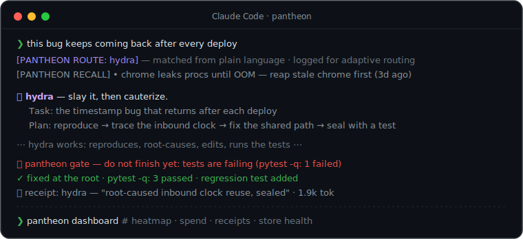

<div align="center">


### One install. Your coding agent stops winging it.

13 mythic disciplines + 3 power tools + 170 merged skills, every one under a pantheon-native name — with memory that recalls itself, receipts for everything it does, and a verification gate that blocks fake "done". For [Claude Code](https://claude.com/claude-code).

 &nbsp; &nbsp; &nbsp; &nbsp;

**[See it work](#what-it-feels-like) · [The disciplines](#the-pantheon) · [Config](#configuration) · [The HUD](#the-hud-optional) · [CLI](#the-store-and-the-cli) · [Credits](CREDITS.md)**

</div>

---

```bash
claude plugin marketplace add MiracleWeb3/pantheon
claude plugin install pantheon@pantheon
```

> [!TIP]
> Restart Claude Code and it's live on your very next prompt. Token-shy? Say *"set pantheon to economy mode"* — one sentence, and it switches to a frugal profile.

## What it feels like

<div align="center">

</div>

Every move is visible: the router says **why** a discipline fired, recall puts the **relevant past lesson** on the table, the discipline announces **what it's about to do**, the gate refuses a **"done" that isn't**, and the receipt records **what actually happened**.

<table>
<tr>
<td width="50%">🎯 <b>Routes itself — and learns you.</b> Plain language fires the right discipline; routes you keep ignoring demote themselves.</td>
<td width="50%">🧠 <b>Recalls itself.</b> Past lessons and corrections inject into matching prompts. No <code>/remember</code>, no digging.</td>
</tr>
<tr>
<td>🛡 <b>Blocks fake "done".</b> Failing tests, TODO stubs, unverified code — the agent is refused permission to stop.</td>
<td>🧾 <b>Proves itself.</b> Per-discipline receipts + a live dashboard: heatmap, spend, store health.</td>
</tr>
<tr>
<td>💸 <b>Budget caps.</b> Session / daily / weekly USD limits — warn, ask, or hard-block at the cap.</td>
<td>🩺 <b>Heals itself.</b> <code>pantheon doctor --fix</code> checks every moving part and repairs what's safe.</td>
</tr>
<tr>
<td>🤝 <b>Spreads through teams.</b> A committed pack file shares config, standards, and lessons with every teammate.</td>
<td>🔨 <b>Forge your own gods.</b> Mint custom disciplines with auto-routes; export them to Cursor / Codex.</td>
</tr>
</table>

## What makes it different

**🎯 It's automatic — and it learns you.** You don't memorize commands. Type *"this bug keeps coming back"* and the `hydra` discipline takes over — root-cause first, reproduce, fix at the root, seal with a regression test. A prompt-router hook reads intent and fires the match; an explicit call (`/pantheon:hydra`) always wins. And the router is **adaptive**: every fire records whether you actually used it, replaced it, or ignored it — a route you keep ignoring demotes itself to a soft suggestion, with old evidence decaying so it can earn its way back.

**🗣 It announces itself.** When a discipline activates — by your hand or the router's — it opens with one line: *which* power took over, *what* it understood your goal to be, and the *steps* it's about to take. You see the plan **before** any work happens, and can redirect. No silent automation.

> 🏛 **hydra** — slay it, then cauterize. **Task:** the timestamp bug that reappears after each deploy. **Plan:** reproduce against real data → trace the inbound clock path → fix the shared carry, not the caller → add a regression test that fails on the old code.

**🧠 It remembers — and recalls by itself.** A learning loop captures your corrections the moment they land into a local SQLite store. Then the headline feature: **retrieval-augmented memory** — every prompt is matched against past lessons (keyword overlap × recency × weight) and the relevant ones inject themselves as context. Hit a bug near one you've solved before and the old lesson is already on the table.

**🛡 It blocks fake "done".** A Stop-hook **verification gate** inspects what actually happened in the turn: if code changed and tests are failing, `TODO`/`.skip`/placeholder stubs got introduced, or a non-trivial change shipped with **no verification at all**, the agent is refused permission to stop and told exactly what to fix (twice, max — then it yields; warn-only in `economy`). Other plugins *advise* this. pantheon *enforces* it.

**🧾 It proves itself.** Every discipline files a one-line **receipt** (what it did or caught, tokens spent). `pantheon dashboard` renders the ledger: a per-discipline heatmap, a 7-day spend sparkline, the receipts feed, store health — the plugin's value made visible instead of vibes.

**💸 It won't surprise you on cost.** Set `budget` caps (session / daily / weekly USD): a warning at 80%, then **warn / ask / hard-block** at the cap — and the HUD flags it. When anything misbehaves, `pantheon doctor` checks every moving part and `--fix` repairs what's safe to repair, always backing up first.

**🤝 It spreads through your team.** Commit a `pantheon.pack.json` to a repo and every teammate inherits it on install: config, disabled disciplines, **team standards**, and shared lessons (imported once, deduped). A new hire gets the team's accumulated scar tissue on day one.

**🔨 You can forge your own gods.** `pantheon forge new deploy-ritual --route "deploy .*prod"` scaffolds a custom discipline — announce block, method, verify step, receipt, auto-route — indistinguishable from a built-in. Share it as a single file, or `pantheon export` the disciplines for Cursor (`.mdc` rules) and Codex/OpenCode (`AGENTS.md`).

## The pantheon

Mythical names, plain-English triggers. Read top-to-bottom and it *is* the lifecycle of a change.

| Skill | Say | The discipline |
|---|---|---|
| 🧵 **`ariadne`** | *"how does this work?"* | **Orient** — read the code-map, past decisions, and prior lessons *before* editing. The thread through the labyrinth. |
| 🕸 **`arachne`** | *"map the codebase"* | **Map** — weave a navigable knowledge graph (nodes, edges, god-nodes) so orientation is a query, not a grep. Builds what `ariadne` reads. |
| 🔮 **`oracle`** | *"how do I use X?"* | **Research** — consult the real docs before an unfamiliar SDK/API. Never code a contract from memory. |
| 🏗 **`daedalus`** | *"build this right"* | **Build** — scope → plan → challenge the plan → build → review with a different lens. |
| 🦉 **`athena`** | *"design the UI"* | **Craft** — interface work with real hierarchy, spacing, type, states, and accessibility. Intentional, never templated. |
| 🔥 **`prometheus`** | *"test first"* | **Test-first** — the failing test before the code. Red → green → refactor. |
| 🐉 **`hydra`** | *"this bug is nasty"* | **Debug** — root cause before fix, reproduce before editing, cauterize with a regression test. |
| 👁 **`argus`** | *"this is huge"* | **Decompose** — split a too-big task, fan out one fresh-context worker per slice, synthesize. |
| ⚖️ **`themis`** | *"review this"* | **Review** — adversarial, severity-ranked, self-verified. The reviewer is never the author. |
| ⛴ **`charon`** | *"land it"* | **Ship** — atomic commits, a clean PR, branch hygiene. Never ships unasked. |
| 🌊 **`lethe`** | *"keep it simple"* | **Simplify** — YAGNI, stdlib before custom, native before dependency, deletion over addition. |
| 📜 **`mnemosyne`** | *"remember this"* | **Learn** — capture corrections, consolidate to memory, promote what recurs into always-loaded rules. |
| 📚 **`alexandria`** | *"document this"* | **Knowledge** — a curated project wiki (the Karpathy LLM-wiki model) whose prose compounds across sessions. |

> **Three knowledge layers, unified.** `arachne` maps the *structure* (your graphify graph), `alexandria` records the *prose* (your Obsidian/ADR wiki — the "why"), and `mnemosyne` holds the *facts* (your memory bank of corrections). `ariadne` reads all three to orient before any work. Graph + wiki + memory, one method.

Plus three power tools in the same style: 📊 **`dashboard`** (the receipts ledger, rendered — heatmap, spend, health), 🩺 **`doctor`** (diagnose + repair the install), 🔨 **`forge`** (author and share your own disciplines).

## Everything, merged in

pantheon doesn't just *point at* the best open-source plugins — it **vendors them in**, so one install gives you all of it. On top of the 16 core disciplines, it bundles the full skill sets of:

- **[superpowers](https://github.com/anthropics/claude-plugins-official)** (Jesse Vincent, MIT) — brainstorming, systematic-debugging, TDD, plan writing/execution, parallel agents, git worktrees, and more.
- **[oh-my-claudecode](https://github.com/Yeachan-Heo/oh-my-claudecode)** (Yeachan Heo, MIT) — its full skill catalog, including the big autonomous modes (now `sisyphus`, `automedon`, `hekaton`…).
- **[ponytail](https://github.com/DietrichGebert/ponytail)** (Dietrich Gebert, MIT) — the lazy-senior-dev discipline set (now the `spartan` family).
- **[ui-skills](https://www.ui-skills.com/) & design collections** — frontend-design, interface-design, animation, three.js, framework skills.

Every vendored skill keeps its original license (see [`LICENSES/`](LICENSES/)) and is attributed in [`CREDITS.md`](CREDITS.md). All rights remain with the original authors. And every one of them now carries a **pantheon-native name** — `spartan` for the lazy-dev discipline set, `sisyphus` / `automedon` / `hekaton` / `pythia` for the engine power modes, plain subject names for the guides — no borrowed branding; the full old→new map lives in [`CREDITS.md`](CREDITS.md). Don't want the bulk? `economy`/`quiet` config and per-skill `disciplines` toggles keep it lean.

## Configuration

pantheon runs full-strength out of the box. Drop a `config.json` at `~/.claude/pantheon/config.json` (global) or `<project>/.pantheon/config.json` (per-project, wins) — or just tell your agent *"set pantheon to economy mode"* and it writes the file for you.

| Preset | Routing | Announce | Recall | Gate | For |
|---|---|---|---|---|---|
| `full` *(default)* | on | shown | 3 lessons | **block** | the whole experience |
| `economy` | suggest | hidden | 1 lesson | warn | saving tokens |
| `quiet` | off | hidden | off | off | full manual control |

<details>
<summary><b>Every knob</b> (override any single one)</summary>

```json
{ "preset": "full", "gate": "warn", "recall": 2,
  "budget": { "weekly": 25, "mode": "ask" },
  "custom_routes": { "deploy .*prod": "deploy-ritual" },
  "disciplines": { "athena": false } }
```

| Knob | Values | Default |
|---|---|---|
| `routing` | `on` · `suggest` · `off` | `on` |
| `announce` | `true` · `false` | `true` |
| `recall` | `0`–`3` past lessons injected per prompt | `3` |
| `gate` | `block` · `warn` · `off` — the verification gate | `block` |
| `clarify` | auto-question vague big asks | `true` |
| `context_guard` | context-fill % that triggers a checkpoint (0 = off) | `85` |
| `receipts` | disciplines file receipts | `true` |
| `budget` | `{session, daily, weekly}` USD caps + `mode: warn·ask·block` | no caps |
| `custom_routes` | `{ "<regex>": "<skill>" }` — beat the built-ins | `{}` |
| `disciplines` | `{ "<skill>": false }` | all on |
| `packs` / `updateCheck` | `true` · `false` | `true` |

See [`config.example.json`](config.example.json) for the annotated version. The update check is a daily, cached, 2-second, fail-silent version ping to GitHub — no telemetry, and `"updateCheck": false` kills it.

</details>

## The HUD (optional)

<div align="center">

</div>

Add to `~/.claude/settings.json`:

```json
"statusLine": {
  "type": "command",
  "command": "python3 ~/.claude/plugins/marketplaces/pantheon/scripts/hud.py"
}
```

Every segment is real data, shown only when it has a value. The **rolling hourly/weekly spend** and **live context %** are things Claude Code doesn't hand a statusline — pantheon derives them itself (a cost-delta ledger, and the true `input + cache` token count from the latest transcript record). `▓` goes green → yellow → red as context fills; over budget, a red `⚠budget` appears.

<details>
<summary><b>Segment guide</b> · and how to chain an existing statusline</summary>

| Segment | Meaning | Source |
|---|---|---|
| `hydra` | active discipline | pantheon router |
| `Fable 5` | model | payload |
| `✳max` | reasoning effort | parsed from `/effort` in the transcript |
| `⧗2h35m` | session wall-clock | `cost.total_duration_ms` |
| `▓47%` | **live context fill** | last turn's real token `usage` (not file size) |
| `+420/-95` | lines added / removed | `cost.total_lines_*` |
| `$6.80` | this session's cost | `cost.total_cost_usd` |
| `⧖1h $2.10` · `wk $18.40` | **rolling hourly / weekly spend** | pantheon's own cost-delta ledger |
| `⎇ main` · `📥3` | branch · unconsolidated lessons | `.git/HEAD` · learning-inbox |

**Already have a statusline?** Claude Code allows one `statusLine`, so pantheon won't silently fight it — chain both: your line renders first, pantheon's segment appends. If your command errors, pantheon shows just its own segment — never a blank bar.

```json
"statusLine": {
  "type": "command",
  "command": "python3 ~/.claude/plugins/marketplaces/pantheon/scripts/hud.py --chain 'your-existing-statusline-command'"
}
```

</details>

## The store and the CLI

Everything pantheon learns and does lands in **one SQLite store** — `~/.claude/pantheon/pantheon.db` (WAL, stdlib, schema-versioned, self-migrating). Lessons, receipts, route outcomes, metrics: one substrate, so every feature compounds on the others. A stable `pantheon` command is kept pointing at the installed plugin (refreshed every session start):

```
pantheon stats                          counts · top disciplines · spend
pantheon dashboard                      full-screen TUI (or --plain)
pantheon doctor [--fix]                 diagnose + repair the install
pantheon lesson add "…" / recall "…"    feed and probe the memory
pantheon receipt add --skill X --note … what a discipline just did
pantheon forge new <name> --route "…"   your own discipline, auto-routed
pantheon pack init / status             team pack in the current repo
pantheon export --target cursor|codex   take the disciplines to other agents
```

(Shim lives at `~/.claude/pantheon/bin/pantheon`; add that dir to `PATH` or call it directly.)

## Composes with your stack — never replaces it

`pantheon` is a **method, not a monolith**. It orchestrates these when present and does the steps by hand when not:

- **[oh-my-claudecode](https://github.com/Yeachan-Heo/oh-my-claudecode)** — the bundled power modes (`sisyphus`, `automedon`, `hekaton`) drive its persistence loops, agents, and Workflow engine when it's installed.
- **A code map** ([graphify](https://github.com/) or any repo map) — `ariadne` queries it before grepping.
- **A decisions wiki** (Obsidian, `docs/adr/`) — `ariadne` / `alexandria` read and write it.
- **Design skills** (`frontend-design`, `shadcn`, …) — `athena` drives whichever you have installed and reviews the output against its craft standard.

With none installed, every skill still works.

## The two ideas underneath

1. **Separate your passes.** Understand ≠ plan ≠ build ≠ verify, and the reviewer is never the author. `daedalus` and `hydra` are the same rigor pointed at opposite problem *shapes* — building vs. diagnosing — which is why they run nearly opposite sequences.
2. **Match the tool to the shape.** A feature is a *planning* problem. A hard bug is a *diagnosis* problem. A giant task is a *decomposition* problem. Reaching for the wrong shape — a heavy build-pipeline on a one-line bug, a single context on a repo-wide migration — is the most common misroute. pantheon names the fork so you take the right branch.

## Under the hood

- **Three hooks, stdlib-only, fail-silent.** `on_prompt.py` (UserPromptSubmit): route + recall + clarifier + context guard + budget. `on_stop.py` (Stop): learning capture + receipts + route outcomes + the verification gate. `session-start.py`: config directive, store migration, CLI shim, team-pack import, update check. A broken hook never breaks your session — every failure path exits 0.
- **Zero dependencies.** No npm, no pip, no build step. Skills are Markdown; hooks, CLI, dashboard, and HUD are plain Python 3 (`sqlite3`/`curses` from the stdlib).
- **Everything ships a self-check.** All 11 modules run `--selftest`; `pantheon doctor` runs the whole suite plus install checks in one command.

## Roadmap

The original 12-feature roadmap **shipped in full** across v0.8 → v1.1 (retrieval-augmented memory, receipts, dashboard, blocking gate, adaptive routing, intent clarifier, context guard, budget caps, doctor, team packs, forge, cross-agent export) — [docs/ROADMAP.md](docs/ROADMAP.md) documents what each feature does and how they layer. Next up is sharpening from real use: file issues at [MiracleWeb3/pantheon](https://github.com/MiracleWeb3/pantheon/issues).

## License

MIT — see [LICENSE](LICENSE). Independent work; merged sources belong to their respective authors, and are credited in [`CREDITS.md`](CREDITS.md) with licenses retained in [`LICENSES/`](LICENSES/).

<div align="center"><sub>Built for people who want their agent to work like an engineer, not a slot machine.</sub></div>
