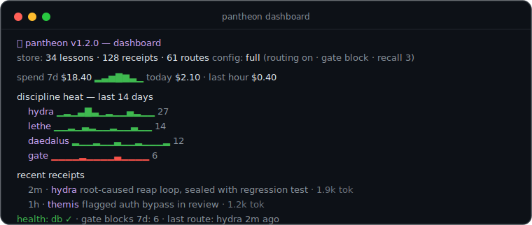
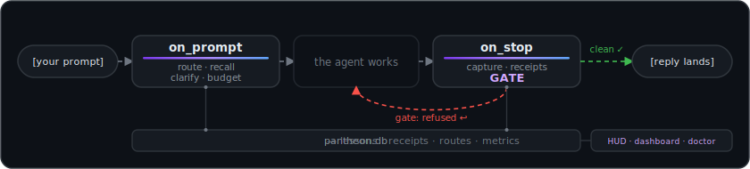

<div align="center">


### One install. Your coding agent stops winging it.

**14 disciplines** (11 mythic + 3 power tools) **+ 170 merged skills = 184** — a router that fires the right one, receipts for everything it does, and a verification gate that blocks fake "done" *and benchmarks itself proving it*. For [Claude Code](https://claude.com/claude-code).

 &nbsp; &nbsp; &nbsp; &nbsp; &nbsp;[](https://github.com/MiracleWeb3/pantheon/actions/workflows/selftest.yml) &nbsp;[](BENCHMARKS.md) &nbsp;

**[See it work](#what-it-feels-like) · [The disciplines](#the-pantheon) · [Config](#configuration) · [The HUD](#the-hud-optional) · [CLI](#the-store-and-the-cli) · [Benchmarks](BENCHMARKS.md) · [Credits](CREDITS.md)**

</div>

---

```bash
claude plugin marketplace add MiracleWeb3/pantheon
claude plugin install pantheon@pantheon
```

> [!TIP]
> Restart Claude Code and it's live on your very next prompt. Token-shy? Say *"set pantheon to economy mode"* — one sentence, and it switches to a frugal profile.

## What it feels like

<div align="center">

</div>

Every move is visible: the router says **why** a discipline fired, the discipline announces **what it's about to do**, the gate refuses a **"done" that isn't**, and the receipt records **what actually happened**.

<sub>Staged frames, real message formats — every line above is the exact text the hooks inject. (An asciinema of a live session is on the wishlist.)</sub>

🛡 **Benchmarked, not asserted** — that gate refusal isn't a mockup: replayed against 21 transcript fixtures on every CI push, it catches **10/10 planted fake-dones** with **0 false positives** → [BENCHMARKS.md](BENCHMARKS.md)

<table>
<tr>
<td width="50%">🎯 <b>Routes itself — and learns you.</b> Plain language fires the right discipline; routes you keep ignoring demote themselves.</td>
<td width="50%">🧾 <b>Proves itself.</b> Per-discipline receipts + a live dashboard: heatmap, spend, store health.</td>
</tr>
<tr>
<td>🛡 <b>Blocks fake "done".</b> Failing tests, TODO stubs, unverified code — the agent is refused permission to stop.</td>
<td>🩺 <b>Heals itself.</b> <code>pantheon doctor --fix</code> checks every moving part and repairs what's safe.</td>
</tr>
<tr>
<td>💸 <b>Budget caps.</b> Session / daily / weekly USD limits — warn, ask, or hard-block at the cap.</td>
<td>🤝 <b>Spreads through teams.</b> A committed pack file shares config and standards with every teammate.</td>
<td>🔨 <b>Forge your own gods.</b> Mint custom disciplines with auto-routes; export them to Cursor / Codex.</td>
</tr>
</table>

## What makes it different

Three mechanics nobody else ships — everything else from the grid above gets its own section below.

**🗣 Every move is announced.** One line before any work: *which* discipline took over, *what* it understood, the *steps* it's about to take — redirect before anything happens. The router is accountable the same way: ignored routes demote themselves (30-day decay).

> 🏛 **hydra** — slay it, then cauterize. **Task:** the timestamp bug that reappears after each deploy. **Plan:** reproduce against real data → trace the inbound clock path → fix the shared carry, not the caller → add a regression test that fails on the old code.

**🛡 "Done" is enforced, not asserted.** The Stop hook inspects the actual turn — failing tests on changed code, introduced `TODO`/`.skip` stubs, unverified non-trivial diffs — and refuses the stop with an exact fix list. Hard evidence (failing checks, stubs) blocks twice; the softer no-verification nudge blocks once; then it always yields — and it fails *open* if its own state can't persist, so it can never wedge a session. Others *advise* this. pantheon *enforces* it — and [measures itself](BENCHMARKS.md).

<div align="center"></div>

## Why not just superpowers, OMC, or claude-mem?

Because they each do *one layer*, and none of them **enforce** anything. Honest snapshot:

| capability | **pantheon** | [superpowers](https://github.com/obra/superpowers) | [oh-my-claudecode](https://github.com/Yeachan-Heo/oh-my-claudecode) | [claude-mem](https://github.com/thedotmack/claude-mem) |
|---|:---:|:---:|:---:|:---:|
| a router that fires the right skill — and learns from your outcomes | ✅ | ⚠️ description matching only | ⚠️ magic keywords | ❌ |
| "done" gate enforced by a hook (not advice) | ✅ blocks | ⚠️ advisory | ⚠️ advisory | ❌ |
| receipts + dashboard of what it did & caught | ✅ | ❌ | ⚠️ HUD only | ❌ |
| hourly/weekly spend + budget caps | ✅ warn·ask·block | ❌ | ⚠️ display only | ❌ |
| team packs — repo-inherited config + standards | ✅ | ❌ | ❌ | ❌ |
| proof — a reproducible benchmark of the enforcement, in CI | ✅ [11/11, 0 FP](BENCHMARKS.md) | ❌ | ❌ | ❌ |
| forge your own discipline, auto-routed | ✅ | ⚠️ authoring guide | ⚠️ skill manager | ❌ |
| take the disciplines to Cursor / Codex | ✅ export | ❌ | ❌ | ❌ |
| ships the others' skill sets too | ✅ 172, attributed | — | — | — |

<sub>⚠️ = partial or manual. Assessment as of July 2026 — if a row went stale, open an issue and it gets fixed. And to be clear: those are excellent projects — pantheon bundles their skills with attribution precisely because they're worth having.</sub>

<div align="center"></div>

## The pantheon

Mythical names, plain-English triggers. Read top-to-bottom and it *is* the lifecycle of a change.

| Skill | Say | The discipline |
|---|---|---|
| 🧵 **`ariadne`** | *"how does this work?"* | **Orient** — read the code-map and past decisions *before* editing. The thread through the labyrinth. |
| 🕸 **`arachne`** | *"map the codebase"* | **Map** — weave a navigable knowledge graph (nodes, edges, god-nodes) so orientation is a query, not a grep. Builds what `ariadne` reads. |
| 🔮 **`oracle`** | *"how do I use X?"* | **Research** — consult the real docs before an unfamiliar SDK/API. Never code a contract from memory. |
| 🏗 **`daedalus`** | *"build this right"* | **Build** — scope → plan → challenge the plan → build → review with a different lens. |
| 🦉 **`athena`** | *"design the UI"* | **Craft** — interface work with real hierarchy, spacing, type, states, and accessibility. Intentional, never templated. |
| 🔥 **`prometheus`** | *"test first"* | **Test-first** — the failing test before the code. Red → green → refactor. |
| 🐉 **`hydra`** | *"this bug is nasty"* | **Debug** — root cause before fix, reproduce before editing, cauterize with a regression test. |
| 👁 **`argus`** | *"this is huge"* | **Decompose** — split a too-big task, fan out one fresh-context worker per slice, synthesize. |
| ⚖️ **`themis`** | *"review this"* | **Review** — adversarial, severity-ranked, self-verified. The reviewer is never the author. |
| ⛴ **`charon`** | *"land it"* | **Ship** — atomic commits, a clean PR, branch hygiene. Never ships unasked. |
| 🌊 **`lethe`** | *"keep it simple"* | **Simplify** — YAGNI, stdlib before custom, native before dependency, deletion over addition. |

> **pantheon does not do memory.** No lesson store, no wiki, no recall injection — [claude-memory-light](https://github.com/MiracleWeb3/claude-memory-light) already indexes every transcript verbatim and answers recall better than a curated table ever did. `arachne` maps the *structure* and `ariadne` reads it; remembering is someone else's job, done properly.

Plus three power tools in the same style: 📊 **`dashboard`** (the receipts ledger, rendered — heatmap, spend, health), 🩺 **`doctor`** (diagnose + repair the install), 🔨 **`forge`** (author and share your own disciplines).

## Everything, merged in

pantheon doesn't just *point at* the best open-source plugins — it **vendors them in**, so one install gives you all of it. On top of the 16 disciplines (13 mythic + 3 power tools), it bundles the full skill sets of:

- **[superpowers](https://github.com/obra/superpowers)** (Jesse Vincent, MIT) — brainstorming, systematic-debugging, TDD, plan writing/execution, parallel agents, git worktrees, and more.
- **[oh-my-claudecode](https://github.com/Yeachan-Heo/oh-my-claudecode)** (Yeachan Heo, MIT) — its full skill catalog, including the big autonomous modes (now `sisyphus`, `automedon`, `hekaton`…).
- **[ponytail](https://github.com/DietrichGebert/ponytail)** (Dietrich Gebert, MIT) — the lazy-senior-dev discipline set (now the `spartan` family).
- **[ui-skills](https://www.ui-skills.com/) & design collections** — frontend-design, interface-design, animation, three.js, framework skills.

Every merged source is attributed per-skill in [`CREDITS.md`](CREDITS.md), and the license texts for superpowers, oh-my-claudecode, and ponytail are retained in [`LICENSES/`](LICENSES/). The guide collection (112 skills) ships with attribution while individual licenses are still being verified — those entries are flagged in CREDITS.md, and any author who wants a skill removed or re-credited gets it, fast, via an issue. All rights remain with the original authors. The flagship sets carry **pantheon-native names** — `spartan` for the lazy-dev discipline set, `sisyphus` / `automedon` / `hekaton` / `pythia` for the engine power modes (old→new map in CREDITS.md) — while guides keep their plain subject names (`vue`, `shadcn`, …). Don't want the bulk? `economy`/`quiet` config and per-skill `disciplines` toggles keep it lean.

<div align="center"></div>

## Configuration

pantheon runs full-strength out of the box. Drop a `config.json` at `~/.claude/pantheon/config.json` (global) or `<project>/.pantheon/config.json` (per-project, wins) — or just tell your agent *"set pantheon to economy mode"* and it writes the file for you.

| Preset | Routing | Announce | Gate | For |
|---|---|---|---|---|
| `full` *(default)* | on | shown | **block** | the whole experience |
| `economy` | suggest | hidden | warn | saving tokens |
| `quiet` | off | hidden | off | full manual control |

**What the automation actually costs, measured from the injected strings:** a prompt that matches nothing gets **0 tokens** injected — silence is the default. When something fires: a route hint ≈ **110 tokens** (economy's one-line nudge ≈ 25), the clarifier ≈ 100, the context-guard nudge ≈ 110 (once per session). Session-wide fixed cost: one ~40-token skills-discovery nudge at session start (what makes 184 skills actually get *considered*; off in `quiet`). And the cost no plugin can hide: Claude Code itself loads every installed skill's name+description — `pantheon doctor` measures pantheon's real figure on your install, and v1.4 put the fattest descriptions on a diet.

<details>
<summary><b>Every knob</b> (override any single one)</summary>

```json
{ "preset": "full", "gate": "warn",
  "budget": { "weekly": 25, "mode": "ask" },
  "custom_routes": { "deploy .*prod": "deploy-ritual" },
  "disciplines": { "athena": false } }
```

| Knob | Values | Default |
|---|---|---|
| `routing` | `on` · `suggest` · `off` | `on` |
| `announce` | `true` · `false` | `true` |
| `gate` | `block` · `warn` · `off` — the verification gate | `block` |
| `clarify` | auto-question vague big asks | `true` |
| `context_guard` | context-fill % that triggers a checkpoint (0 = off) | `85` |
| `receipts` | disciplines file receipts | `true` |
| `budget` | `{session, daily, weekly}` USD caps + `mode: warn·ask·block` | no caps |
| `custom_routes` | `{ "<regex>": "<skill>" }` — beat the built-ins | `{}` |
| `disciplines` | `{ "<skill>": false }` | all on |
| `usage` | `{mode: auto·subscription·api, five_hour_tokens, weekly_tokens}` — pin exact plan limits for the `≈` HUD meters | `auto` |
| `packs` / `updateCheck` | `true` · `false` | `true` |

See [`config.example.json`](config.example.json) for the annotated version. The update check is a daily, cached, 2-second, fail-silent version ping to GitHub — no telemetry, and `"updateCheck": false` kills it.

</details>

## The HUD (optional)

<div align="center">

</div>

Add to `~/.claude/settings.json`:

```json
"statusLine": {
  "type": "command",
  "command": "python3 ~/.claude/plugins/marketplaces/pantheon/scripts/hud.py"
}
```

Every segment is real data, shown only when it has a value. **Subscription meters built in:** `⏳5h` and `📅wk` show how much of your Claude plan's 5-hour window and weekly cap you've used — exact server-side percentages when Claude Code sends them (≥2.1, Pro/Max), with a reset countdown appearing near the cap; on older versions pantheon derives the windows itself from your local transcripts (marked `≈`, self-calibrating, incremental byte-offset reads with the discovery walk memoized — ~10–15ms of work per render on top of Python's own startup). API-key sessions show a `⌁api` tag instead — their real usage is the `$` spend. The **rolling hourly/weekly spend** and fallback **context %** are pantheon's own derivations (a cost-delta ledger + real token counts). `▓` goes green → yellow → red as context fills; over budget, a red `⚠budget` appears.

<details>
<summary><b>Segment guide</b> · and how to chain an existing statusline</summary>

| Segment | Meaning | Source |
|---|---|---|
| `hydra` | active discipline | pantheon router |
| `Fable 5` | model | payload |
| `✳max` | reasoning effort | parsed from `/effort` in the transcript |
| `⧗2h35m` | session wall-clock | `cost.total_duration_ms` |
| `▓47%` | **live context fill** | payload (CC ≥2.1) or last turn's real token `usage` |
| `⏳5h 42%` | **subscription 5-hour window used** | payload `rate_limits` (exact) or transcript-derived `≈` |
| `📅wk 63%` | **subscription weekly cap used** | same — `↻47m` reset countdown appears ≥85% |
| `+420/-95` | lines added / removed | `cost.total_lines_*` |
| `$6.80` | this session's cost | `cost.total_cost_usd` |
| `⧖1h $2.10` · `wk $18.40` | **rolling hourly / weekly spend** | pantheon's own cost-delta ledger |

**Already have a statusline?** Claude Code allows one `statusLine`, so pantheon won't silently fight it — chain both: your line renders first, pantheon's segment appends. If your command errors, pantheon shows just its own segment — never a blank bar.

```json
"statusLine": {
  "type": "command",
  "command": "python3 ~/.claude/plugins/marketplaces/pantheon/scripts/hud.py --chain 'your-existing-statusline-command'"
}
```

</details>

## The store and the CLI

Everything pantheon does lands in **one SQLite store** — `~/.claude/pantheon/pantheon.db` (WAL, stdlib, schema-versioned, self-migrating). Lessons, receipts, route outcomes, metrics: one substrate, so every feature compounds on the others. This is what the receipts ledger looks like rendered:

<div align="center">

</div>

<sub>The real `pantheon dashboard --plain` output format, rendered from a demo store — your store stays on your machine.</sub>

A stable `pantheon` command is kept pointing at the installed plugin (refreshed every session start):

```
pantheon stats                          counts · top disciplines · spend
pantheon dashboard                      full-screen TUI (or --plain)
pantheon doctor [--fix]                 diagnose + repair the install
pantheon receipt add --skill X --note … what a discipline just did
pantheon forge new <name> --route "…"   your own discipline, auto-routed
pantheon pack init / status             team pack in the current repo
pantheon export --target cursor|codex   take the disciplines to other agents
```

(Shim lives at `~/.claude/pantheon/bin/pantheon`; add that dir to `PATH` or call it directly.)

## Composes with your stack — never replaces it

`pantheon` is a **method, not a monolith**. It orchestrates these when present and does the steps by hand when not:

- **[oh-my-claudecode](https://github.com/Yeachan-Heo/oh-my-claudecode)** — the bundled power modes (`sisyphus`, `automedon`, `hekaton`) drive its persistence loops, agents, and Workflow engine when it's installed.
- **A code map** (a graphify knowledge graph, or any repo map you keep) — `ariadne` queries it before grepping.
- **A decisions record** (Obsidian, `docs/adr/`) — `ariadne` reads it while orienting.
- **Design skills** (`frontend-design`, `shadcn`, …) — `athena` drives whichever you have installed and reviews the output against its craft standard.

With none installed, every skill still works.

## The two ideas underneath

1. **Separate your passes.** Understand ≠ plan ≠ build ≠ verify, and the reviewer is never the author. `daedalus` and `hydra` are the same rigor pointed at opposite problem *shapes* — building vs. diagnosing — which is why they run nearly opposite sequences.
2. **Match the tool to the shape.** A feature is a *planning* problem. A hard bug is a *diagnosis* problem. A giant task is a *decomposition* problem. Reaching for the wrong shape — a heavy build-pipeline on a one-line bug, a single context on a repo-wide migration — is the most common misroute. pantheon names the fork so you take the right branch.

## Under the hood

- **Three hooks, stdlib-only, fail-silent — audit them in 30 seconds:** [`hooks/on_prompt.py`](hooks/on_prompt.py) (UserPromptSubmit: route + clarifier + context guard + budget), [`hooks/on_stop.py`](hooks/on_stop.py) (Stop: receipts + route outcomes + the verification gate), [`hooks/session-start.py`](hooks/session-start.py) (config directive, store migration, CLI shim, team-pack import, update check). No network calls except the opt-out daily version check; a broken hook never breaks your session — every failure path exits 0.
- **Zero dependencies.** No npm, no pip, no build step. Skills are Markdown; hooks, CLI, dashboard, HUD, and the MCP server are plain Python 3 (`sqlite3`/`curses` from the stdlib). CI runs the full suite on Linux, macOS, and Windows (Python 3.9 and 3.13); the hooks invoke `python3`, which Windows needs on PATH (the Microsoft Store Python provides `python3.exe`).
- **Receipts your subagents can file.** A ~200-line stdlib MCP server exposes `pantheon_receipt_add` / `pantheon_stats`, so a dispatched subagent can ask "what do we know about X?" instead of starting blind. Recall itself is BM25-ranked (IDF-weighted, length-normalized) — rare shared terms outweigh common ones.
- **Four bundled agents, model-tiered.** `reviewer` (opus, read-only), `worker` (sonnet), `researcher` (sonnet, read-only), `scout` (haiku) — the disciplines dispatch to these when the oh-my-claudecode engine isn't installed, so decompose/review work is cost-tiered out of the box.
- **It measures itself.** [`BENCHMARKS.md`](BENCHMARKS.md): 21 replayed transcript fixtures through the real gate pipeline — 10/10 planted fake-dones caught, 0/10 false positives — re-run on every CI push.
- **Everything ships a self-check.** Every module runs `--selftest`; `pantheon doctor` runs the whole suite plus install checks in one command — including a transcript-format tripwire that catches a Claude Code format change before it silently blinds the gate.

<div align="center">

</div>

## Questions people ask

> [!NOTE]
> **Local-first by construction.** Receipts and the spend ledger live in `~/.claude/pantheon/` and never leave your machine. The only network call is an optional once-daily version check (2s timeout, `"updateCheck": false` kills it). No telemetry, ever.

<details>
<summary><b>The gate blocked me and I disagree.</b></summary>

Say so in your reply — it always yields, by design: after one block for a missing-verification nudge, after two for hard failures. To soften it permanently: `"gate": "warn"` (message only) or `"gate": "off"` in your config.

</details>

<details>
<summary><b>I already have superpowers / OMC / ponytail installed. Conflict?</b></summary>

No — everything is namespaced (`pantheon:…` vs theirs). Better: pantheon *drives* the oh-my-claudecode engine (its agents and persistence loops) through `sisyphus` / `automedon` / `hekaton` when it's present, and works standalone when it's not.

</details>

<details>
<summary><b>Too many tokens?</b></summary>

The default is already frugal: prompts that match nothing get **zero** injected tokens, and the session-start hook is silent on default config. When automation does fire it's ~25–250 tokens (see the measured table in Configuration). Still too much? `"preset": "economy"` — no announce prose, soft routing, 1-lesson recall, warn-only gate. `quiet` turns every automatic behavior off. Or just tell the agent *"set pantheon to economy mode"*.

</details>

<details>
<summary><b>Uninstall cleanly?</b></summary>

`claude plugin uninstall pantheon@pantheon` — then `rm -rf ~/.claude/pantheon` if you also want the local store (ledger, receipts) gone. Nothing else is touched.

</details>

<div align="center"></div>

## Roadmap

The original 12-feature roadmap **shipped in full** across v0.8 → v1.1 (receipts, dashboard, blocking gate, adaptive routing, intent clarifier, context guard, budget caps, doctor, team packs, forge, cross-agent export) — [docs/ROADMAP.md](docs/ROADMAP.md) documents what each feature does and how they layer. Next up is sharpening from real use: file issues at [MiracleWeb3/pantheon](https://github.com/MiracleWeb3/pantheon/issues).

## License

MIT — see [LICENSE](LICENSE). Independent work; merged sources belong to their respective authors, and are credited in [`CREDITS.md`](CREDITS.md) with licenses retained in [`LICENSES/`](LICENSES/).

<div align="center">


<sub><b>Built for people who want their agent to work like an engineer, not a slot machine.</b><br>
If the gate ever catches a fake "done" for you — <a href="https://github.com/MiracleWeb3/pantheon/stargazers">⭐ star it</a> so others find it.</sub>

</div>
